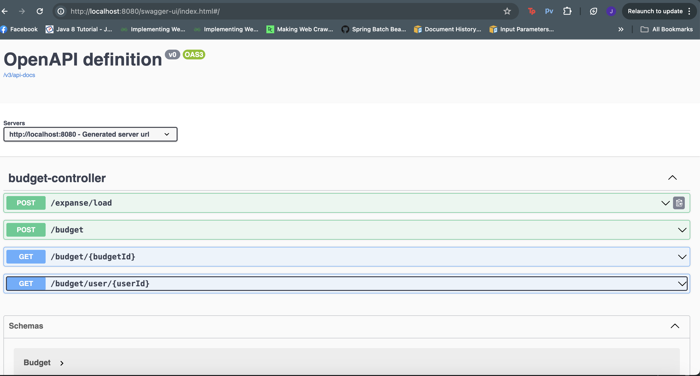
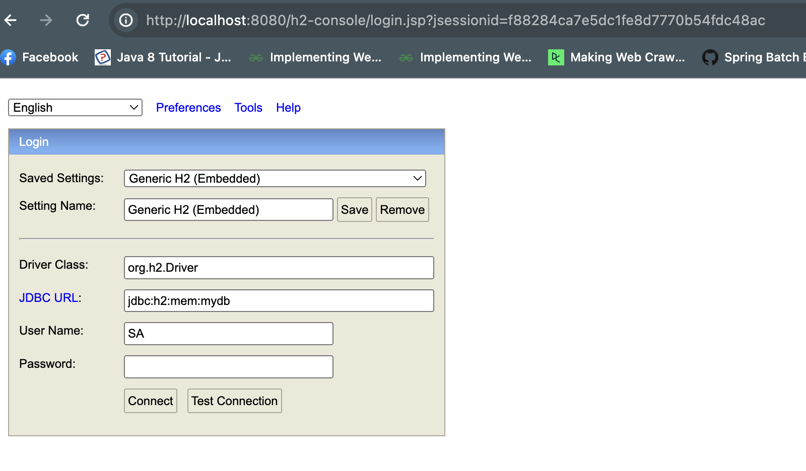

# Budgeting System

Budgeting System Service based on Spring Boot 3.2.5
JDK openjdk-21

Our primary goals are:

* Build a Budgeting service to create, track budget and expanses

# Installation and Getting Started

Steps for running application
* Build : ./gradlew build
* Run : java -jar build/libs/demo-0.0.1-SNAPSHOT.jar

* Data for users and Transactions are getting loaded to db during application boot up.
* file name : /src/main/resources/data.sql.

* Users : Users with id : 1,2,3,4,5 created
* Transactions : 10 transaction created during Bootup

Endpoints
* health endpoints : http://localhost:8080/actuator/health
* swagger endpoints : http://localhost:8080/swagger-ui/index.html
  
* h2 db endpoints : http://localhost:8080/h2-console
  H2 database setup : 
* jdbc url : jdbc:h2:mem:mydb
* user name : SA
* Password : no password


Responsibility of APIs
* create Budget - POST /budget
* financialCategory has option only : SHOPPING,RENT,DINING only
Payload example : 
``` json
{
  "userId": "1",
  "relativeId": [
    "2","3","4","5"
  ],
  "budgets": [
    {
      "totalBudgetAmount": 3000,
      "currency": "USD",
      "financialCategory": "SHOPPING",
      "startDate": "2024-04-28T05:01:04.021Z",
      "endDate": "2024-04-30T05:01:04.021Z"
    },
{
      "totalBudgetAmount": 2000,
      "currency": "USD",
      "financialCategory": "RENT",
      "startDate": "2024-04-28T05:01:04.021Z",
      "endDate": "2024-04-30T05:01:04.021Z"
    },
{
      "totalBudgetAmount": 2000,
      "currency": "USD",
      "financialCategory": "DINING",
      "startDate": "2024-04-28T05:01:04.021Z",
      "endDate": "2024-04-30T05:01:04.021Z"
    }
  ]
}

*  Load transactions as Expanses- POST /expanse/load

*  Get Budget by budgetId - GET /budget/{budgetId}

*  Get All Budget associated with user  by userId - GET /budget/user/{userId}


# BudgetingSystem
